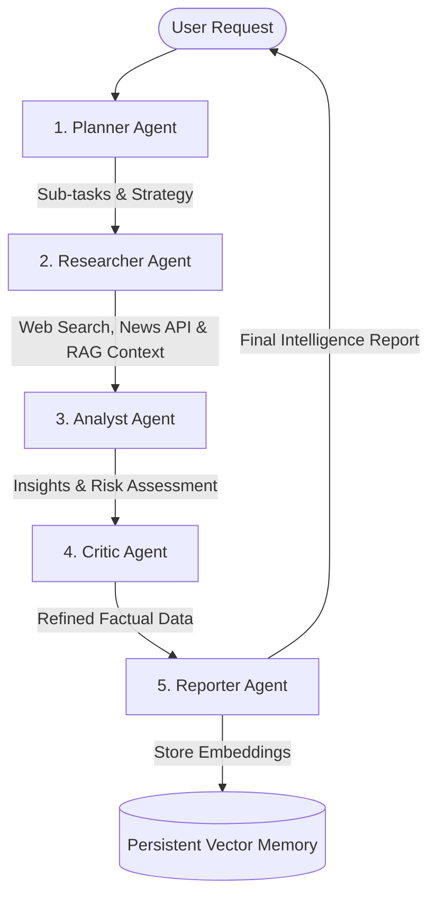

# 🚀 Autonomous Multi-Agent System: Real-Time Global Event Analyzer

An advanced, real-time autonomous intelligence system powered by multi-agent AI workflows, persistent RAG vector memory, and dynamic web search capabilities.

[](https://saatvikkotwal-code.github.io/real_time_global_event_Analyzer/)
[](https://picks-gen-comparison-experiments.trycloudflare.com)
[](https://fastapi.tiangolo.com)
[](https://vitejs.dev)

---

## 🌟 Live Demonstration & Deployment Links

- 🌐 **Primary Live Application (GitHub Pages)**: [https://saatvikkotwal-code.github.io/real_time_global_event_Analyzer/](https://saatvikkotwal-code.github.io/real_time_global_event_Analyzer/)
  - *Includes full **Standalone Interactive Demo Mode** directly in browser, permitting complete pipeline exploration, vector memory inspection, and sector risk tracking without requiring local backend installation.*
- ⚡ **Live Public Backend Tunnel (Cloudflare)**: `https://picks-gen-comparison-experiments.trycloudflare.com`
  - *Active high-reliability live backend tunnel.*
- ⚙️ **Local Backend API Documentation (Swagger UI)**: `http://localhost:8000/docs`

> 💡 **Connecting GitHub Pages to your Live Backend**:
> Launch the backend tunnel using `python backend/launch_tunnel.py`. In the GitHub Pages web app, click **API Settings** in the top navigation bar and enter your live public tunnel URL (`https://picks-gen-comparison-experiments.trycloudflare.com`) to switch seamlessly between Standalone Demo Mode and Live AI Backend Mode!

---

## 🤖 Multi-Agent Orchestration Architecture

The platform orchestrates 5 specialized AI agents sequentially to perform deep intelligence research:



### 🧠 Specialized Agent Roles:
1. **Planner Agent**: Decomposes complex user queries into structured execution steps and sub-queries.
2. **Researcher Agent**: Gathers real-time global news, live web data, and retrieves context from persistent vector memory.
3. **Analyst Agent**: Identifies emerging trends, cross-references sector risk indicators, and extracts key data points.
4. **Critic Agent**: Validates logical coherence, verifies factual consistency, and refines analytical depth.
5. **Reporter Agent**: Synthesizes the final markdown Intelligence Report and commits vector embeddings into long-term memory.

---

## ✨ Key Features

- ⚡ **Real-Time Global Analysis**: Automatically scans and analyzes AI Tech, Cybersecurity, Autonomous Robotics, and Semiconductor sectors.
- 💾 **Persistent RAG Vector Store**: Caches past research and daily scans to enhance future query context using vector memory embeddings.
- 🔄 **Automated 24h Background Scheduler**: Performs automated daily background scans to track evolving risks and industry shifts.
- 🎛️ **Multi-Model LLM Engine**: Seamlessly cascades between Google Gemini (Gemini 2.0 / 1.5 Flash), OpenAI (GPT-4o / GPT-4o-mini), and Smart Synthesizers.
- 🎨 **Glassmorphism UI Dashboard**: Premium dark-mode user interface with real-time pipeline status tracking and interactive report viewers.

---

## 🛠️ Tech Stack & Directory Structure

```text
real_time_global_event_Analyzer/
├── backend/                  # FastAPI Python backend
│   ├── agents/               # Multi-Agent definitions (Planner, Researcher, Analyst, Critic, Reporter)
│   ├── api/                  # REST API routes & endpoints
│   ├── memory/               # Persistent Vector Store & Automated Scheduler
│   ├── tools/                # Web Search, News API & RAG utilities
│   ├── llm_factory.py        # LLM Engine Factory (Gemini / OpenAI / Fallback)
│   └── main.py               # FastAPI entry point & CORS configuration
├── frontend/                 # Vite + React Frontend Dashboard
│   ├── src/                  # React components & Glassmorphism design system
│   │   ├── App.jsx           # Main Dashboard Console
│   │   └── index.css         # Modern design tokens & micro-animations
│   └── vite.config.js        # Vite dev server & proxy settings
├── README.md                 # Project Documentation
└── .gitignore                # Environment & workspace exclusions
```

---

## 🚀 Local Installation & Setup Guide

### 1. Prerequisites
- Python 3.10 or higher
- Node.js v18 or higher

### 2. Backend Setup
```bash
cd backend
python -m venv venv

# Activate Virtual Environment (Windows PowerShell)
.\venv\Scripts\Activate.ps1

# Install Dependencies
pip install -r requirements.txt

# Run Local FastAPI Backend:
python -m uvicorn main:app --host 0.0.0.0 --port 8000

# OR Run FastAPI Backend + Live Public Localtunnel concurrently:
python launch_tunnel.py
```

### 3. Frontend Setup
```bash
cd ../frontend
npm install
npm run dev -- --host 0.0.0.0
```

Open **`http://localhost:3000`** in your browser to access the local dashboard.

---

## 📄 License

Distributed under the MIT License. See `LICENSE` for more information.
